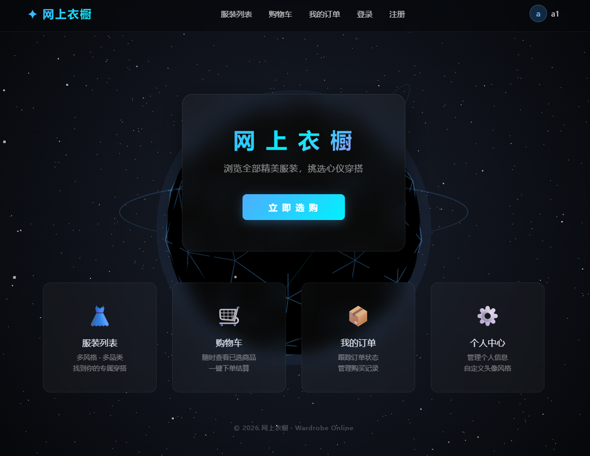
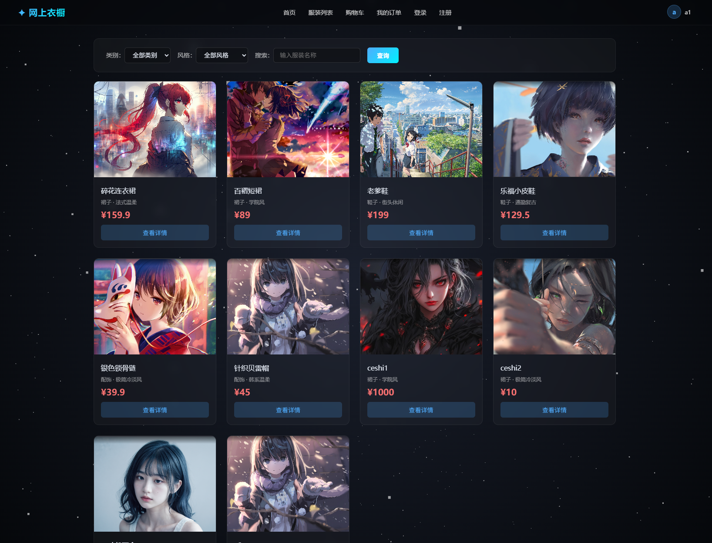
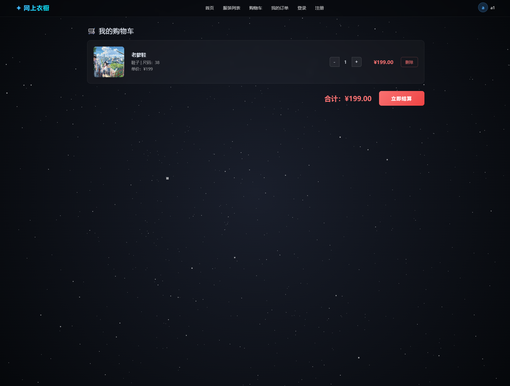

# 网上衣橱 — Wardrobe Online

基于 **Java Servlet + MySQL** 的服装购物商城，前后端分离，含用户端和管理端。

## 技术栈

| 层级 | 技术 |
|------|------|
| 前端 | HTML5 / CSS3 / JavaScript / Axios / Three.js |
| 后端 | Java 21 / Tomcat 10.1 / Jakarta Servlet 6.0 |
| 数据库 | MySQL 8.0 / Druid 1.2 连接池 / Apache DbUtils |
| 鉴权 | JWT（java-jwt 4.4）+ 拦截过滤器 |
| 序列化 | Jackson 2.15 |
| 构建 | Maven 3.8（war 包） |

## 项目结构

```
javaweb_end_test/
├── wardrobe_back/               # 后端 Maven 项目
│   └── wardrobe_back/
│       ├── pom.xml
│       └── src/main/
│           ├── java/com/itheima/
│           │   ├── controller/  # Servlet：Clothes / Login / Cart / Order / UploadFile
│           │   ├── service/     # 业务层
│           │   ├── dao/         # 数据访问层（DbUtils + Druid）
│           │   ├── model/       # 实体类 + Result 统一响应
│           │   ├── filter/      # CorsFilter / AccessFilter（JWT鉴权）
│           │   └── utils/       # DruidUtils / JwtUtils
│           └── resources/
│               └── druid.properties   # 数据库连接配置
│
└── wardrobe_front/              # 前端静态页面
    ├── index.html               # 首页（Three.js 3D 科技球 + 星空）
    ├── pages/
    │   ├── login.html           # 登录
    │   ├── register.html        # 注册
    │   ├── goods.html           # 服装列表（分类/风格筛选）
    │   ├── detail.html          # 服装详情 + 尺码选择
    │   ├── cart.html            # 购物车
    │   ├── order.html           # 我的订单
    │   ├── userInfo.html        # 个人中心
    │   ├── adminLogin.html      # 管理员登录
    │   ├── adminIndex.html      # 后台首页
    │   ├── clothesAdmin.html    # 服装管理（CRUD + 图片上传）
    │   ├── orderAdmin.html      # 订单管理
    │   └── userAdmin.html       # 用户管理
    ├── js/
    │   ├── request.js           # Axios 封装（统一 baseURL + JWT 拦截）
    │   └── util.js              # 公共工具函数
    ├── css/                     # 样式
    ├── api/                     # 各模块 API 函数
    └── images/                  # 服装图片 + 头像
```

## 功能概览

### 用户端
- 🔐 注册 / 登录（JWT 鉴权）
- 👗 服装浏览（按分类、风格筛选，模糊搜索）
- 🔍 商品详情（尺码展示）
- 🛒 购物车（增删改）
- 📦 下单结算
- 👤 个人信息管理 / 头像显示

### 管理端
- 📋 服装管理：上架 / 编辑 / 下架 + 图片上传
- 📋 订单管理：查看全部订单
- 📋 用户管理：查看全部用户

## 数据库表

| 表名 | 说明 |
|------|------|
| t_user | 用户表 |
| t_clothes | 服装表 |
| t_type | 服装分类（裙子/鞋子/配饰…） |
| t_size | 尺码表（S/M/L…） |
| t_cart | 购物车 |
| t_order | 订单表 |

## 快速开始

### 1. 数据库

创建 MySQL 数据库并导入数据：

```sql
CREATE DATABASE wardrobe DEFAULT CHARSET utf8mb4;
```

修改 `wardrobe_back/wardrobe_back/src/main/resources/druid.properties` 中的数据库连接信息：

```properties
url=jdbc:mysql://localhost:3306/wardrobe?useUnicode=true&characterEncoding=UTF-8
username=root
password=你的密码
```

### 2. 后端启动

```bash
cd wardrobe_back/wardrobe_back
mvn clean package -DskipTests
```

将 `target/wardrobe_back.war` 部署到 Tomcat 10 的 `webapps/` 目录，启动 Tomcat。

API 默认地址：`http://localhost:8080/wardrobe_back`

### 3. 前端访问

直接用浏览器打开 `wardrobe_front/index.html`，或部署到任意静态服务器。

## API 接口

### 公开接口
| 方法 | 路径 | 说明 |
|------|------|------|
| POST | /register | 注册 |
| POST | /login | 登录（返回 JWT token） |
| GET | /allClothes | 服装列表（支持 ?style=&type=） |
| GET | /allTypes | 所有分类 |
| GET | /allStyles | 所有风格 |
| GET | /clothesByName?clothesName= | 模糊搜索 |
| GET | /clothDetails?clothId= | 服装详情 + 尺码 |

### 需登录（Header 带 token）
| 方法 | 路径 | 说明 |
|------|------|------|
| GET/POST | /cart/* | 购物车操作 |
| GET/POST | /order/* | 订单操作 |
| GET/POST | /user/* | 用户信息 |

### 后台管理
| 方法 | 路径 | 说明 |
|------|------|------|
| POST | /addClothes | 上架服装 |
| POST | /editClothes | 编辑服装 |
| POST | /delClothes | 下架服装 |
| POST | /uploadFile | 图片上传 |

## 架构特点

- **三层分层**：Controller（Servlet）→ Service → DAO
- **统一响应格式**：`{code: 200, msg: "操作成功", data: ...}`
- **JWT 鉴权流程**：登录返回 token → 前端存 localStorage → 请求拦截器自动带 token → 后端 AccessFilter 校验
- **CORS 跨域**：CorsFilter 统一处理，支持前端静态文件直开
- **Druid 连接池**：初始 5 / 最大 20 连接
- **首页 3D**：Three.js 粒子星空 + 二十面体科技线框球 + 光晕 + 双轨环 + 五速异步旋转

## 页面截图

> 替换为实际截图路径





---

**开发时间**：2026 年 6 月

